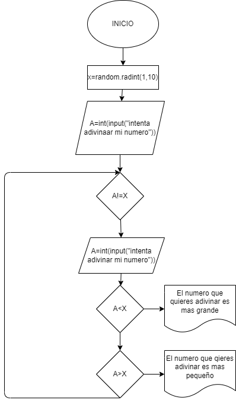

# Adivinar un numero
Intentar adivinar un nümero cualquiera y por cada cíclo de juego  se da una instrucción para que la persona se aserque más al número que desea adivinar.
## Diagrama de flujo
(Diagrama de flujo)